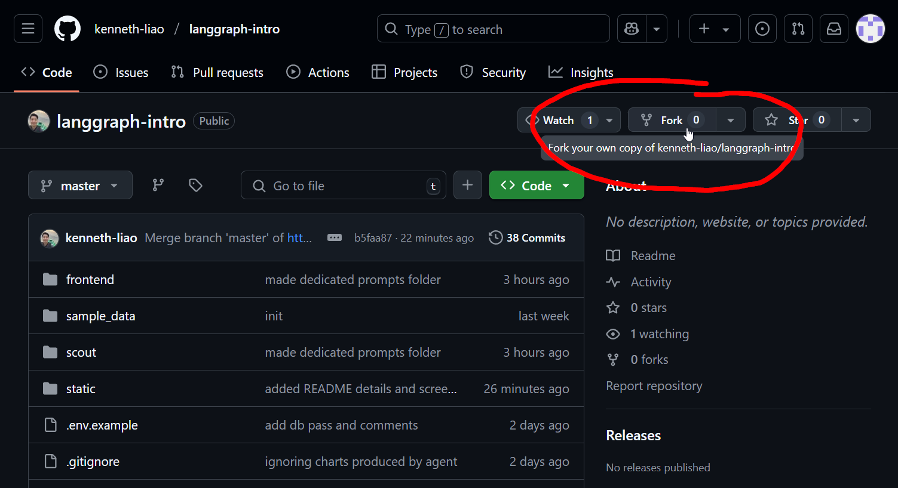
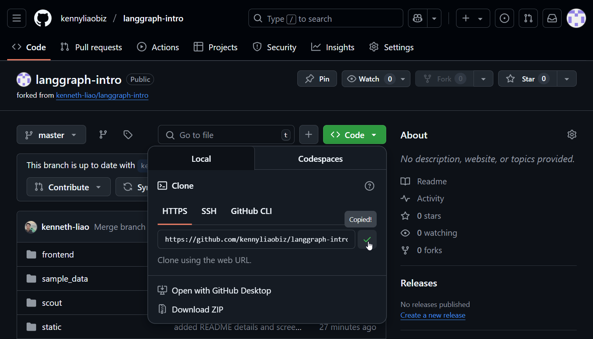
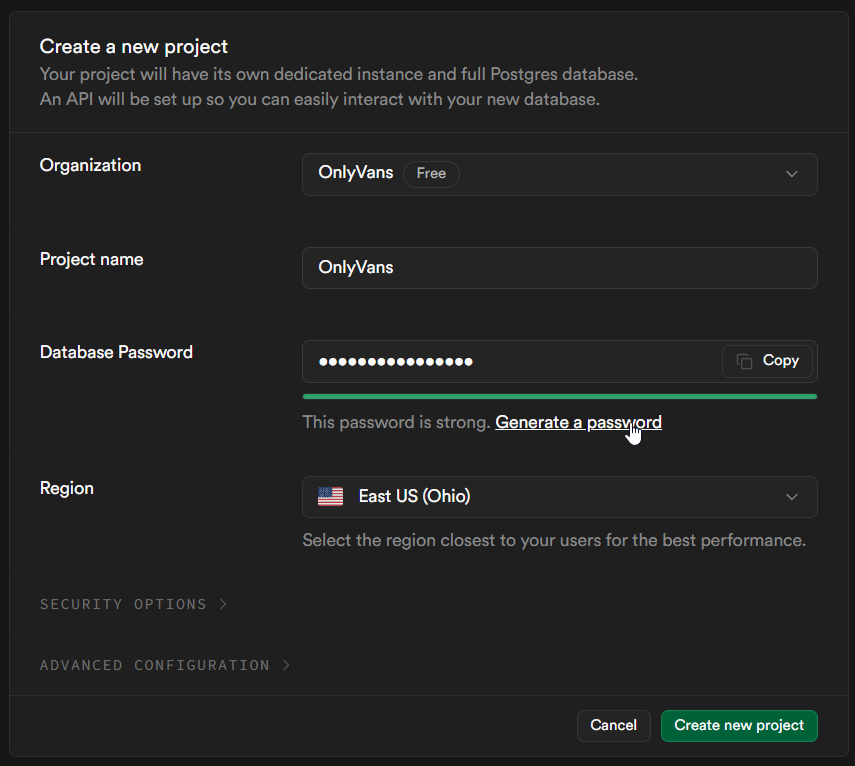
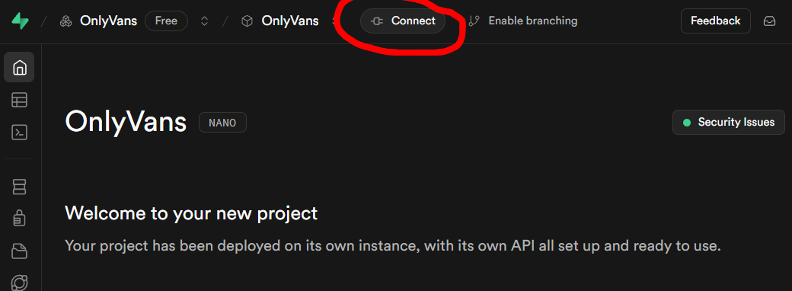
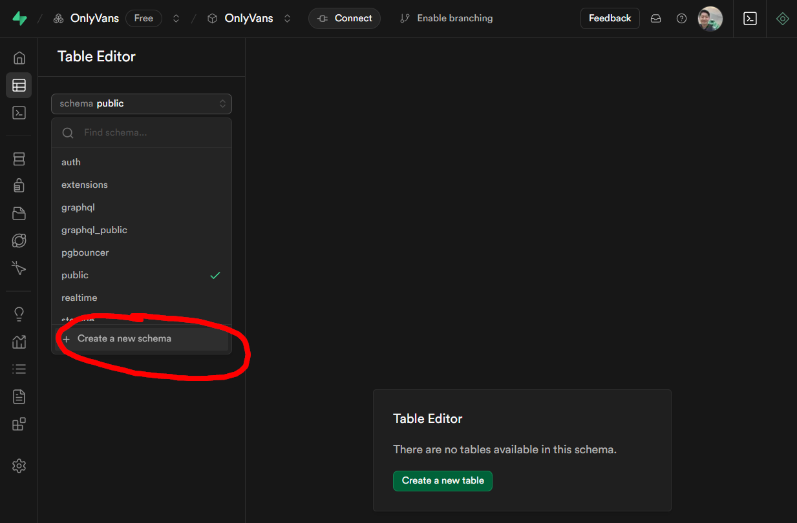
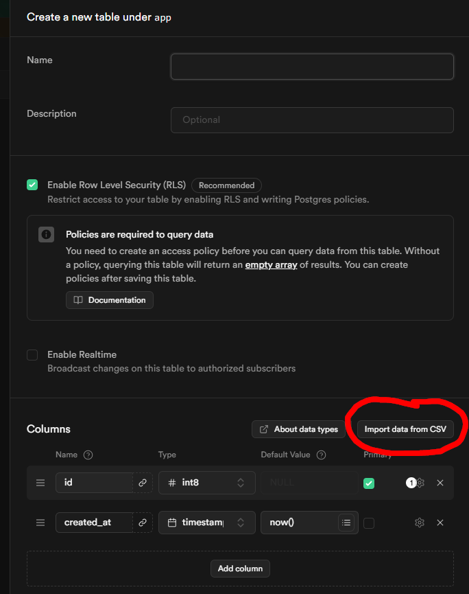

# LangGraph Intro

This project gives a fundamental introduction to LangGraph by using it to build a simple but powerful data analytics AI agent that can query your database, perform analyses, and generate visualizations. This is an end-to-end, full-deployed AI agent that will teach you core Langgraph concepts so that you can build amazing AI systems yourself. It's meant to be a starting point so add to this example to expand on the agent's capabilities and create your own full-deployed AI agents. Everything covered is free except for usage of the OpenAI API - however feel free to adopt the code to use any provider including local models for free.

Watch the [Youtube video](https://youtu.be/31JoTDm7jkM) and [**Subscribe**](https://kenneth-liao.kit.com/73ed616e37) to my free community to get the accompanying cheat-sheet with in-depth notes and more advanced topics.

## Requirements

- Python 3.12
- OpenAI API key
- Supabase account (optional for persistance and deployment)
- Langsmith account (optional for tracing)
- Render account (optional for deployment)

## Setup

Only steps 1 through 4 are required to get the agent up and running locally. Steps 5-7 are optional if you want to deploy the agent to the cloud to interact with from anywhere.

### 1. FORK the repo

If you want to follow everything through deploying your agent, then you'll want to fork the repo. Forking is required to deploy because you'll need to publish the repo to your own Github for deployment on Render. If you don't plan to deploy, you can just clone this repo instead.

1. To fork the repo, click the fork button in the top right corner of the repo page. 

2. Navigate to the local directory on your machine where you want to clone the repo.

3. Clone **your** repo to your local machine. 

```bash
git clone [YOUR REPO URL]
```

4. Enter the project directory

```bash
cd langgraph-intro
```

### 2. Setup the required environment

#### Using uv (recommended)

The recommended way is to use the package manager uv as it's fast, efficient, and makes the whole process much easier! See [uv](https://github.com/onlyvans/uv) for information on how to install uv.

If using uv, we can create a virtual environment in the project directory and install the required packages with two commands.

```bash
uv venv
```

```bash
uv sync
```

We also want to install the local onlyvans package in editable mode so that we can import it to our frontend scripts, and so that any changes you make will be automatically reflected. Be sure to include the period at the end of the command.

```bash
uv pip install -e .
```

### 3. Set up the .env file

1. Rename or copy the `.env.sample` file to `.env`. We will fill in the required environment variables in the next steps.

### 4. Set up the OpenAI API key

1. Create an OpenAI account at [platform.openai.com](https://platform.openai.com/).
2. Navigate to the Dashboard in the top Menu.
3. From the side menu, select API Keys.
4. Create an API key and save it in the `.env` file.

### 5. Set up the database (optional)

We are using Supabase for our Postgresql database. Supabase is easy to set up and offers a generous free tier. You can optionally connect any database of your choosing by simply changing the SUPABASE_URL and DATABASE_URI in the .env file.

1. Create a Supabase account at supabase.com.
2. Create a new project called OnlyVans. I recommend using the generate password tool that Supabase provides and SAVE the password in your `.env` file. 

3. At the top of the project page, click on the connect button and we're going to copy two connection strings to the `.env` file. 

    - Set the `SUPABASE_URL` to the connection string for the transaction pooler.
    - Set the `DATABASE_URI` to the connection string for the session pooler.
    - Make sure you replace the password in both connection strings with the password you saved in the `.env` file.
    - For context, the DATABASE_URI is only required for deployment. It's used exclusively by the Langgraph Server API for persistence. The SUPABASE_URL is used by our agent to query the database.

4. Select the new project and navigate to the Table Editor in the side menu.
5. Click on the schema dropdown and create a new schema called `onlyvans`.



6. Make sure the `onlyvans` schema is selected, sometimes it defaults back to public so check each time you create a new table that it's under the `onlyvans` schema.
7. Create a new table called `creators`.



8. You'll see a pop up and you can select the import data from CSV button to automatically load the data and set the schema. **You'll have to set the `id` column to be the primary key.** Repeat this for the other tables by loading all of the data in the sample_data folder.

### 6. Create a Langsmith account (optional)

Langsmith is used for logging and monitoring. This is completely optional but highly recommended as it makes it easy to track and debug your LangGraph applications. You can create a free account at [langsmith.com](https://smith.langchain.com/). Create a new tracing project, create an API key and save it in the `.env` file.

### 7. Create a Render account (optional)

Render is used for deploying the LangGraph server. This is completely optional but highly recommended as it makes it easy to deploy your LangGraph applications. You can create a free account at [render.com](https://render.com/).

## Deployment

The deployment is going to leverage the Langgraph CLI which allows us to create a Dockerfile for our Langgraph server. This has already been done for you in the root directory. This Dockerfile will be used by the Render web service to build and deploy the Langgraph server. The web service will have a CI/CD pipeline that will automatically build and deploy the Langgraph server whenever you push to the main branch. To deploy your agent, first ensure you've published your project to Github and linked your Github to Render. Then you can simply follow along this [YouTube Episode](https://youtu.be/SGt786ne_Mk) where we take the agent that we've built here and deploy the fully-featured Langgraph Server API to serve your agent from anywhere!
